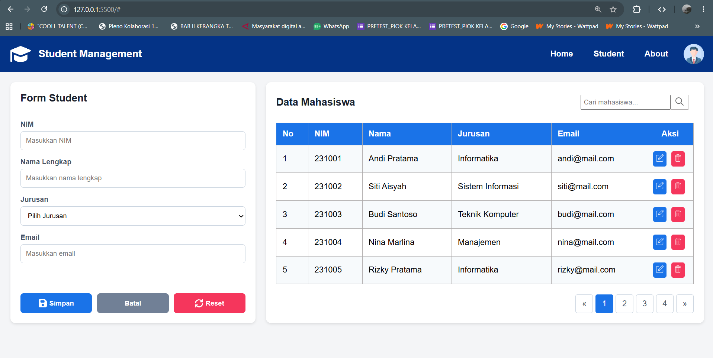

# Student Management Dashboard

Tugas ini adalah implementasi User Interface halaman dasboard untuk manajemen data mahasiswa. Tugas ini menggunakan struktur HTML dasar dan CSS murni.

### Identitas
Nama : Benedictus Imanuel Wicaksono 
NRP  : 5025251039

## Fitur Utama

* **Tata Letak Dua Kolom:** Halaman membagi ruang untuk formulir input di sisi kiri (35%) dan tabel data di sisi kanan (65%) yang direkayasa agar tingginya selalu sejajar secara otomatis.
* **Formulir Mahasiswa Terstruktur:** Memiliki kolom pengisian NIM, Nama Lengkap, pilihan Jurusan berbasis *dropdown*, dan Email. Grup tombol Simpan, Batal, dan Reset diposisikan rapi hingga menyentuh dasar panel bagian bawah.
* **Tabel Data Presisi:** Menampilkan daftar mahasiswa dengan desain kolom rapi. Kolom "Aksi" di ujung kanan dikalibrasi khusus agar menyusut dan membungkus tombol Edit serta Hapus dengan pas tanpa menyisakan ruang kosong berlebih.
* **Indikator Visual:** Dilengkapi bilah pencarian, komponen navigasi paginasi, serta visual *hover effect* berupa perubahan kecerahan saat kursor diarahkan pada tombol.

## Cara Pembuatan

1. **Struktur Kerangka (HTML):** Tata letak kerangka dibangun dari nol. Komponen layar dipilah ke dalam kontainer modular (`.beranda`, `.student`, `.data-mhs`). Aset ikon disisipkan lewat kombinasi kode *inline SVG* dan tautan gambar eksternal.
2. **Penerapan Gaya (CSS3):** Semua bentuk, warna, bayangan (*box-shadow*), dan ukuran dieksekusi terpisah di file `styles.css`.
3. **Pengaturan Tata Letak (Flexbox):** Pembuatan tata letak sangat mengandalkan CSS Flexbox. Properti `display: flex` diaplikasikan secara meluas untuk menyejajarkan navigasi atas, membelah layar menjadi dua panel (`align-items: stretch`), memusatkan posisi ikon di dalam tombol, serta mendistribusikan ruang kosong secara otomatis.

## Mengapa Web Ini Tidak Interaktif?

Aplikasi web ini sepenuhnya statis. Kolom pencarian tidak memfilter tabel, formulir belum bisa menyimpan data mahasiswa baru, dan tombol-tombol aksi tidak akan memicu perubahan apapun.  
Hal ini diterapkan karena sasaran utama penugasan ini berfokus murni pada metode rekayasa antarmuka (*UI Layouting*). Kode sengaja dibatasi hanya pada elemen kerangka dan presentasi visual (HTML dan CSS) untuk mereplikasi bentuk, dimensi, dan rasio posisi agar hasil akhirnya identik 100% dengan gambar contoh latihan yang dijadikan referensi. Logika pemrograman dan manipulasi data dinamis (seperti JavaScript atau *backend*) tidak disertakan agar pengerjaan tetap fokus pada penguasaan CSS dasar.

## Screenshots

